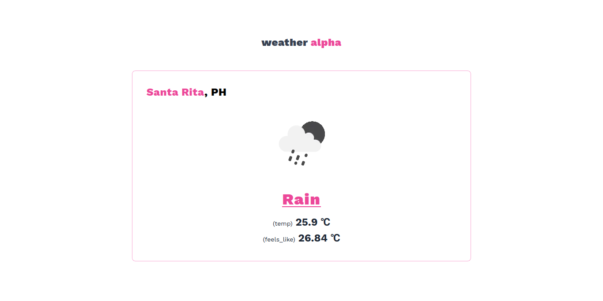

    <h1>weather-alpha</h1>
    
a simple weather app

## Screenshot

## Weather API

- **[OpenWeatherMap](https://openwweathermap.org)** is used in this project.
- An custom api wrapper is implemented in order to protect the leaking of **`API Keys`**.

##

### &copy; TheBoringDude
